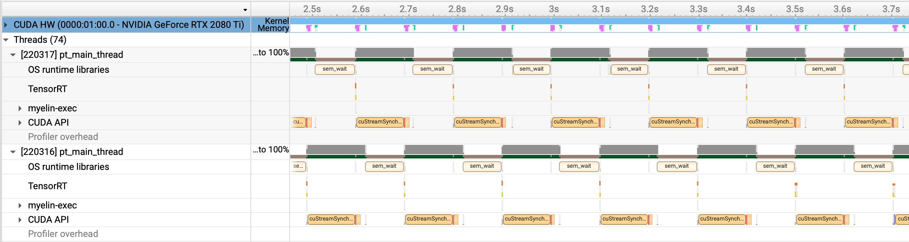

# RealCUGAN-TensorRT

## Overview

RealCUGAN-TensorRT is a project dedicated to optimizing the inference speed of [RealCUGAN](https://github.com/bilibili/ailab/tree/main/Real-CUGAN).
This project is implemented based on TensorRT and includes further code optimizations, enhancing the inference performance of RealCUGAN.

What we provide:
1. Refactored code for more logical class definitions and calls (both from TensorRT or tranditional pytorch), improving overall code structure and maintainability.
2. Significantly optimized speed using TensorRT implementation.
3. Provided ready-to-use scripts for both image and video super-resolution tasks.
    1. For videos: we output videos as '.mp4' file, and the subtitles will be moved to the new file.
    2. For images: we use opencv to load and store images.

TODO:

**Models:**
- [x] 2x model
- [ ] 3x model
- [ ] 4x model

**Fucntion:**
- [x] Video super resolution
- [x] Image super resolution
- [ ] Faster `sr_tool.py`

## Performance Improvement



According to our benchmarks, we fully utilize the GPU for our purpose.

Testing on an NVIDIA RTX 2080Ti shows the following performance improvements:
* Original RealCUGAN: 3.5 FPS
* After code optimization: 4.0 FPS
* With TensorRT implementation and optimizations: 9.8 FPS
Through our optimizations, the inference speed of RealCUGAN has improved to approximately 280%.

Our CLI tool, `sr_tool.py`, is capable of 8.9FPS when generating super resolution for 1080P video

## Environment Setup

### Hardware Requirements

NVIDIA RTX 20 series or newer NVIDIA GPUs

**Important** : Sufficient GPU memory is required. Your GPU should be able to run the original RealCUGAN with `cache_mode=0` without memory issues.

### Installation Steps

1. Install CUDA and cuDNN
2. Clone this repo: `git clone https://github.com/JeremyGuo/RealCUGAN-TensorRT.git && cd RealCUGAN-TensorRT`
3. Install requirements `pip install -r requirements.txt`
4. Install pytorch according to the official website.
5. Download weights `XXX.pth` from the original RealCUGAN repo: [RealCUGAN](https://github.com/bilibili/ailab/tree/main/Real-CUGAN).

**Important** : TensoRT changes API frequently, thus this project only supports to `10.5.0`.

## Usage

### From CLI

`python3 ./sr_tool.py -i A.jpg -o B.jpg` and `python3 ./sr_tool.py -i A.mp4 -o B.mp4`

More details of CLI tool is in `python3 ./sr_tool.py -h`

### From Python

``` python
from sr_tool import sr_video, sr_image, sr_create_engine
from config import config

engine = sr_create_engine(config, start=True)
sr_image(engine, 'A.jpg', 'B.jpg')
sr_video(engine, 'A.mkv', 'B.mkv')
engine.stop()
```

Or using our library like a streaming tool.

``` python
from sr_engine import SREngine
from upcunet2x import RealCUGANUpScaler2x
model1 = RealCUGANUpScaler2x(...)
model2 = RealCUGANUpScaler2x(...)
engine = SREngine([model1, model2])

for i in range(64):
    engine.put((ANYTING, image))
while not stop_flag:
    for i in range(32):
        ANYTING, result = engine.get()
    for i in range(32):
        engine.put((ANYTHING, image))
engine.stop()
```

## For Testing

You could you `python3 benchmark.py` for basic evaluaiton.

The profiling result of the above is in `profile.nsys-rep`

## Something More

This project is also used to my project [Mikan Tracker](https://github.com/JeremyGuo/MikanTracker) to automatically track torrents and RSSes.

``` bash
apt-get install libtiff5-dev libjpeg8-dev libopenjp2-7-dev zlib1g-dev libfreetype6-dev liblcms2-dev libwebp-dev tcl8.6-dev tk8.6-dev python3-tk libharfbuzz-dev libfribidi-dev libxcb1-dev
```